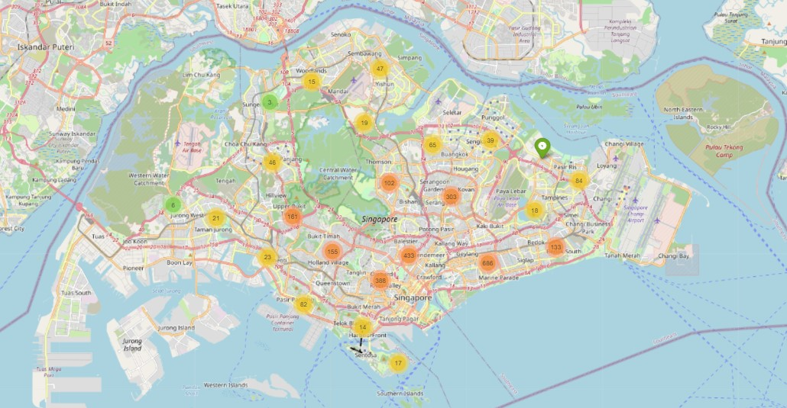

# Datameka Competition
This is a competition for the [Datameka](https://datameka.com) platform. 
## Background
House Hacking: Predicting Singapore’s Housing Prices 
The Singapore housing market has undergone an unprecedented rise in prices in recent years especially since COVID outbreak. Due to this price surge, it is a significant concern for the general population looking for a place of residence, as well as for the government attempting to maintain a stable real estate market.

* House Price Mapping in Singapore :

## Objective
- [ ] Data understanding
- [ ] Data preprocessing
- [ ] Modeling
- [ ] Evaluation
- [ ] Deployment

